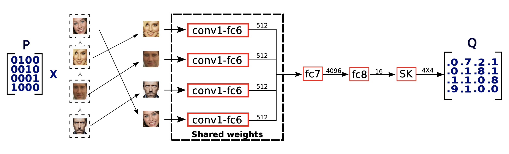
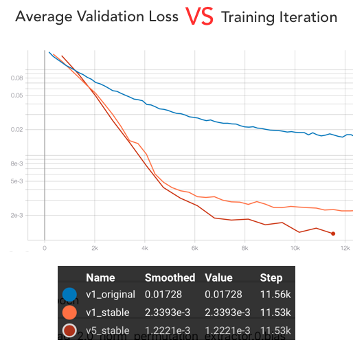

# deep_perm_net_v2

## Description of implemented variations of DeepPermNet (with improvements)

This repo contains the modifications of the [DeepPermNet](https://arxiv.org/abs/1704.02729).

* **v1** - vanilla DeepPermNet (original and [with stable sinkhorn normalization](https://arxiv.org/abs/1805.07010v1))

* **v2** - DeepPermNet with entropy relaxation

In order to find a permutation matrix we should apply Mixed-Integer solver that is not differentiable. We can relax that by adding the regularization entropy term that penalizes values that are far away from either zero or one.

* **v3** - DeepPermNet with another interpretation (cvxpy version)

Originally output from the NN layers before SK was considered already as Permutation Matrix. We changed that interpretation and supposed that the output can be a transport cost matrix. Thus we can apply [Sinkhorn algorithm](https://pythonot.github.io/all.html?highlight=sinkhorn#ot.sinkhorn) with cxvpy framework.

* **v4** - DeepPermNet with unstable Sinkhorn-Knopp iterative algorithm (by Denis Kuznedelev)

* **v5** - DeepPermNet with stable Sinkhorn-Knopp iterative algorithm (by Denis Kuznedelev)

## Result & Comparison

* **v2** - diverges
* **v3** - converges, but extremely slow -> infeasible
* **v4** - throws numerical erros at some training iteration

Other models converges and below the resulted validation loss (L1 loss) is depicted.

## Conclusion

As we can see **v1** with additional stabilization of the sinkhorn normalizer can outperform the original result. Moreover **v5** with the new interpretation of the layers and the new Sinkhorn-Knopp algorithm (by Denis Kuznedelev) outperfoms even the version with the stabilized normalizer.
